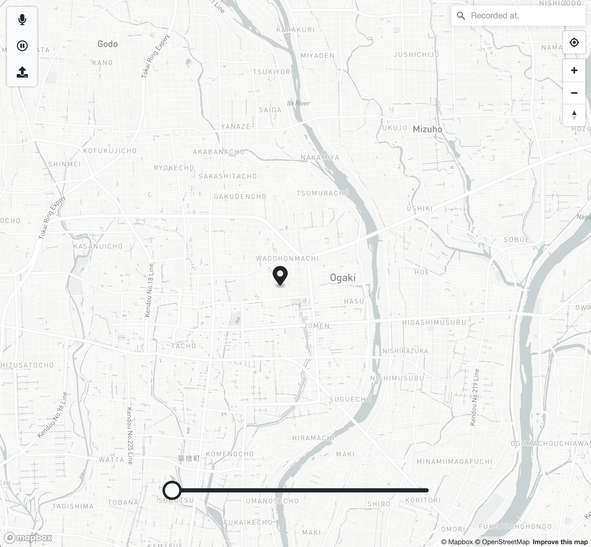

# VOICE-NOISE
"VOICE | NOISE" is a sound mapping and recording tool using RNNoise, Recorder.js, and mapbox.  
It works in Safari.

## Install
```sh:fish
git clone git@github.com:makobouzu/VOICE-NOISE.git
cd VoiceNoise
npm install
```

## Demo
You need to create a .env file and database with a postgresql.  

```sh:fish
cd VoiceNoise
npm run devStart 
```


## Reference

* [RNNoise](https://github.com/xiph/rnnoise "RNNoise")
* [sysprog21/rnnoise](https://github.com/sysprog21/rnnoise "RNNoise_sample")
* [wegylexy/rnnoise_wasm](https://github.com/wegylexy/rnnoise_wasm "rnnoise_wasm")
* [s1r-J/Recorderjs](https://github.com/s1r-J/Recorderjs "Recorder.js")
* [mapbox](https://www.mapbox.com/ "mapbox")

> Copyright (c) 2017, Mozilla  
Copyright (c) 2007-2017, Jean-Marc Valin  
Copyright (c) 2005-2017, Xiph.Org Foundation  
Copyright (c) 2003-2004, Mark Borgerding  

